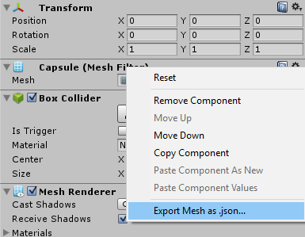
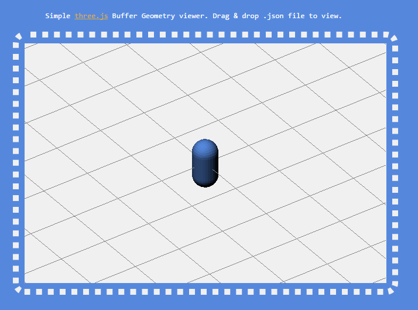

PopThreeJsBufferGeometry
=======================

Small script to export a mesh as a .json that is compatible with three.js's BufferGeometry class.

Export context menu
-----------------------
This class not only adds some helper functions. But it also adds a context menu for meshfilters for a right-click export straight from the editor.

Three.js demo
-----------------------
I needed to test this when developing. So I made a viewer. This works locally by allowing a drag & drop of an exported .json file.

